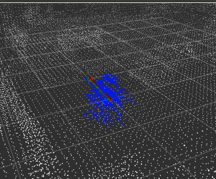

# Particle Filter Localization  
Particle Filter Localization  is a ros2 package of Particle Filter Based Localization in 3D using LiDAR/IMU.

## node
pf_localization_node
- input  
/initial_pose  (geometry_msgs/PoseStamed)  
/cloud  (sensor_msgs/PointCloud2)  
/map  (sensor_msgs/PointCloud2)  
/imu  (sensor_msgs/Imu)  
/tf 
- output  
/curent_pose (geometry_msgs/PoseStamped)

## params

|Name|Type|Default value|Description|
|---|---|---|---|
|pub_period|int|10|publish period[ms]|
|num_particles|int|100|numbers of particels|
|voxel_leaf_size|double|0.2|a down sample size of a input cloud[m]|

## demo

```
wget https://openspur.org/~atsushi.w/dataset/mcl_3dl/short_test.bag
```

```
ros2 launch particle_filter_localization pf.launch.py
```

```
ros2 topic pub pf_localization/initial_pose geometry_msgs/PoseStamped '{header: {stamp: {sec: 1476334344, nanosec: 561867202}, frame_id: "map"}, pose: {position: {x: 0.075144559145, y: -0.0197359323502}, orientation: {z: 0.999897136204, w: 0.0143428383376}}}' --once
```

```
ros2 bag play -s rosbag_v2 short_test.bag
```


    
